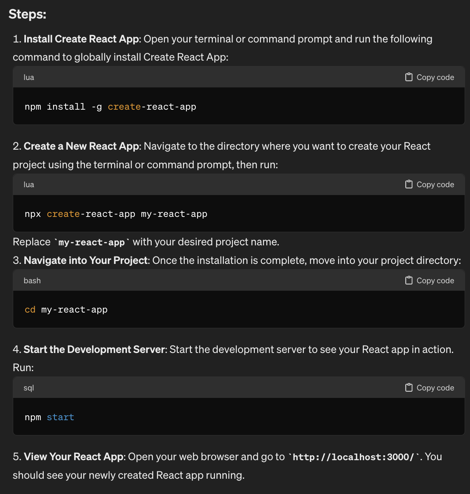
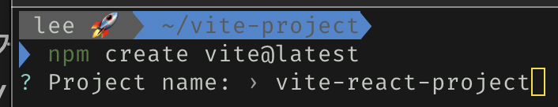
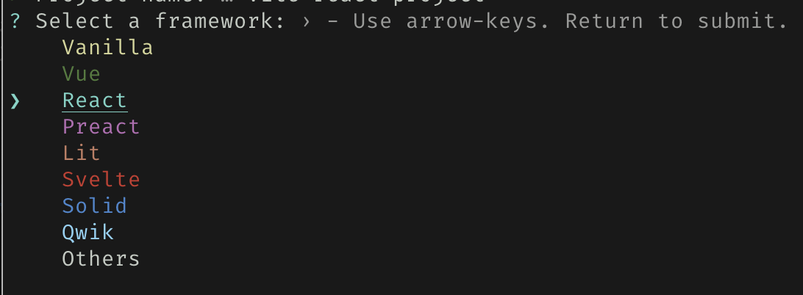
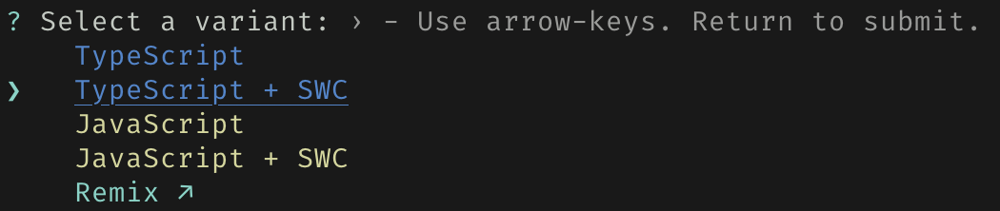
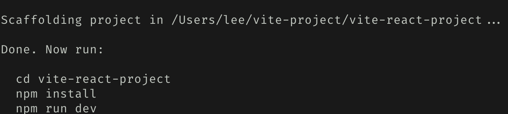
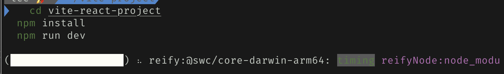
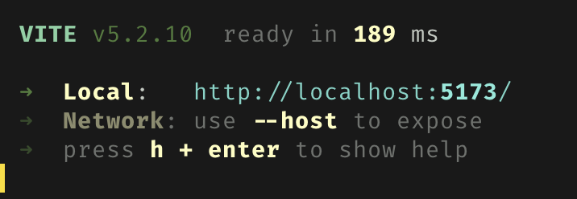
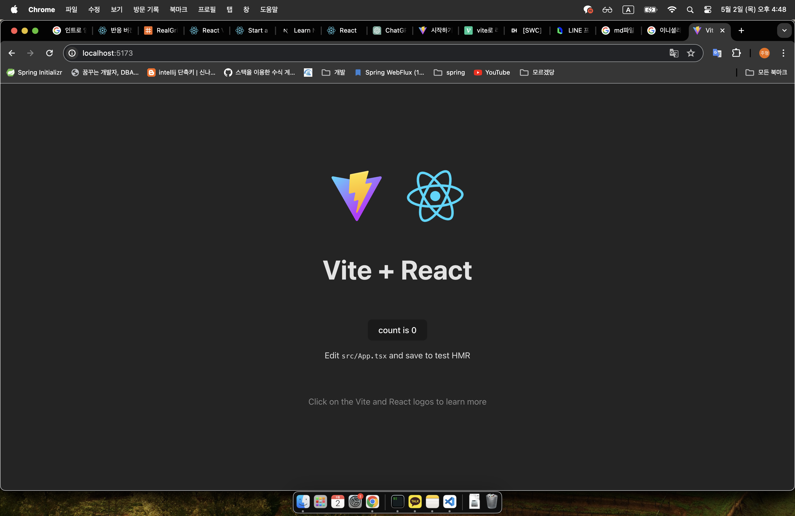

## React를 학습전에 기억하기 하셨으면 하는 내용있습니다 


#### 1. NodeJs

JavaScript 런타임 환경 즉 
프로그램이 실행되는 환경을 의미합니다.

Node.js의 등장으로 JavaScript를 이용하여 서버 측 코드를 작성할 수 있는 것이지 서버측 환경이 아닙니다.

#### 2. npm (Node Package Manager)

해당 프로젝트에 맞추기 위한 매니저입니다

자바 진영에 Maven과 Gradle와 똑 같다고 생각하시면 됩니다 


#### 3. nvm (Node Version Manager)

해당 프로젝트에 맞는 노드 버전을 맞쳐주기 위한 매니져입니다

설치 URL

windows : [https://github.com/coreybutler/nvm-windows/releases](https://github.com/coreybutler/nvm-windows/releases)


mac : brew install nvm 

### ps) 자주 사용되는 nvm 명령어 
```bash
nvm -v
```
nvm 버전 확인
```bash
nvm list
```
 node 설치된 버전 목록
```bash
nvm list available
```
원격 서버 버전 목록  
```bash
nvm install $version
```
해당 노드 버전 설치
```bash
nvm use $version
```
노드 버전 사용
```bash
nvm alias default $version
```
기본 설정 노드 버전 지정

## React 프로젝트 생성하기 전 서론 

우선 Chat-GPT에게 React 프로젝트 생성법을 물어보겠습니다 

질문 내용은 "Please tell me how to create a React project."입니다



중요한 1과 2를 간단하게 설명하자면 

1. create-react-app 패키지를 전역으로 설치한다

2. react 프로젝트를 생성한다 

ps) 해당 질문은 2024년 5월 2일에 chat-GPT에 질문 한 것입니다 

Chat-GPT가 알려준 방법은 CRA(create-react-app)패키지를 사용해서 프로젝트를 생성했습니다.

 여러 블로그에서 해당 방법에 대해서 서술하고 있으나 

 더욱 빠르고 효율적인 웹 애플리케이션 개발을 위한 선택지는 따로 있습니다 

 CRA기준 중속성과 소스코드를 동시에 번들링 하였지만 vite는 
 애플리케이션의 모듈을 중속성과 소스코드 두 가지 카테고리로 나누어 개발 서버의 반영 시간을 개선합니다.

중속성 쪽 사전 번들링 기능은 Esbuild를 사용하고 있는데, Go로 작성된 Esbuild는 Webpack, Parcel과 같은 기존의 번들러 대비 10-100배 빠른 속도를 제공합니다.


수정또한 매우 잦은 소스코드쪽은 Native ESM을 이용해 

브라우저가 요청하는 대로 해당 소스 코드를 반영하고 번들링합니다 

ps) 너무 간략하게 설명하여 더 자세한 내용은 [링크](https://ko.vitejs.dev/guide/why.html)에서 확인하세요


## React 프로젝트 생성하기

vite로 리엑트 프로젝트를 생성해보겠습니다

#### 1. 콘솔창에 아래의 명령어를 입력해주세요
```bash
npm create vite@latest
```
#### 2. 프로젝트명을 설정합니다  

<br>
<br>

#### 3. 프레임워크를 선택합니다 

<br>
<br>

#### 3. 사용한 언어를 선택합니다

ps) SWC(Speedy Web Complier)는 Rust로 제작된 자바스크립트용 컴파일러며 크로스 브라우징위해 사용된다 SWC이전에는 babel를 사용하였다 
<br>
<br>

#### 4. 프로젝트가 초기화가 완료 되었습니다 

<br>
<br>

#### 5. 프로젝트 패키지 다운 후 실행

<br>
<br>

#### 6. 정상적인 실행시 dev 서버 URL 출력합니다

<br>
<br>

#### 7. 정상 웹브라우져 접속확인


