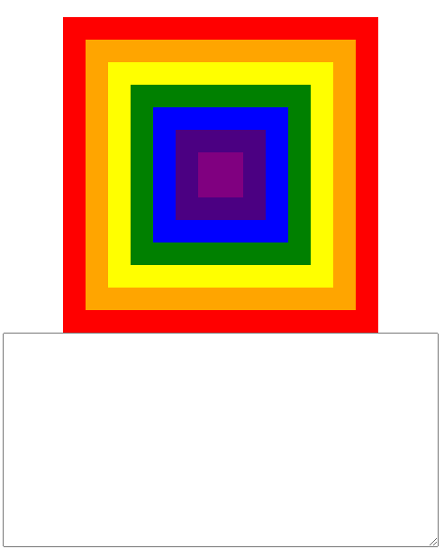
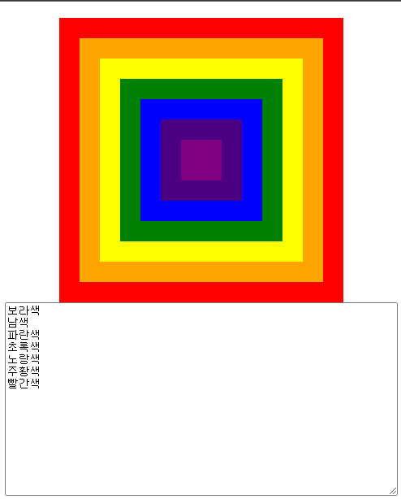

# 이벤트 

## 이벤트를 학습전에 기억하기 하셨으면 하는 내용있습니다 

#### 1. 이벤트 버블링

이벤트는 이벤트 타겟 부모롬에게 전달이 됩니다 

[예제](appendix/event_Bubbling.html)를 만들어 확인 해보게습니다 

아래와 같이 무지개색으로 박스를 만들었으며 



js 소스 는 box라는 클레스 전부 찾아와 각각 boxEvent를 달았습니다 


```js
    let boxEvent = (e) =>{
        let str = printbox.value
        const re = /[가-힣]+색/g;
        const color = e.currentTarget.className.match(re);
        str+= color[0]+'\n'
        printbox.value = str
    }


    let printbox = document.querySelector('.printbox'); 

    document.querySelectorAll('div[class^=box]').forEach((e)=>{e.onclick = boxEvent;})
```

보라색을 클릭시 처음 보라색이 출력되며 순차적으로 빨간색까지 출력되었습니다



#### 2. 이벤트 캡쳐링


