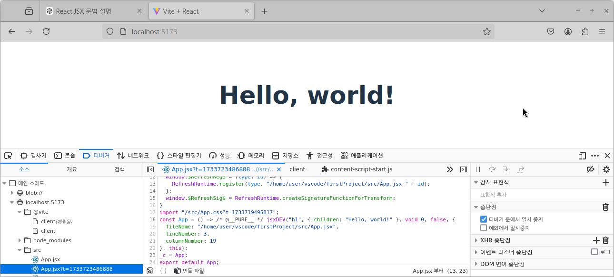
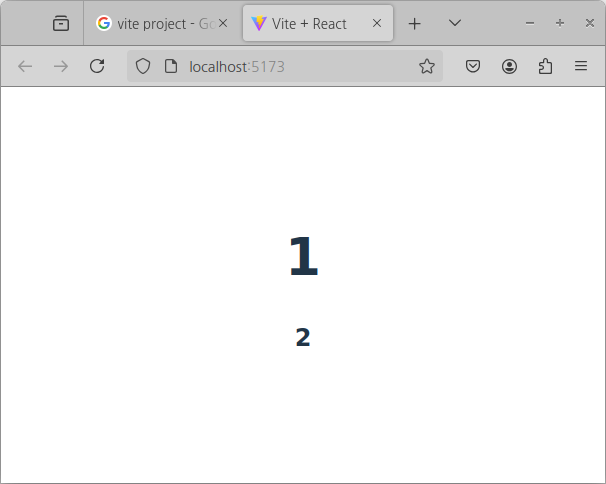
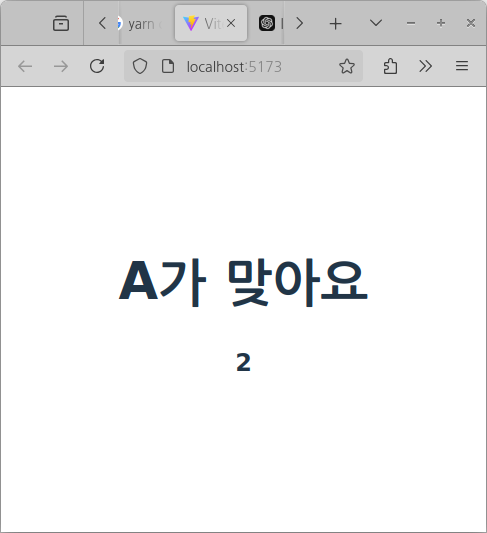
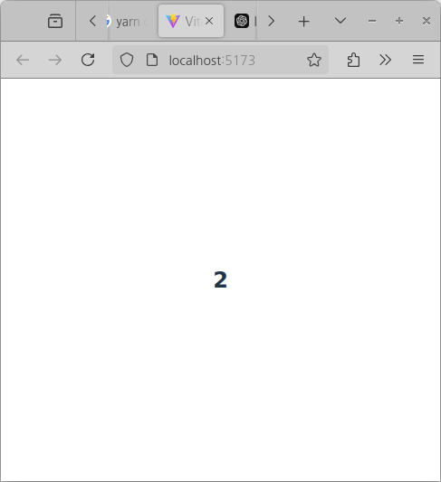
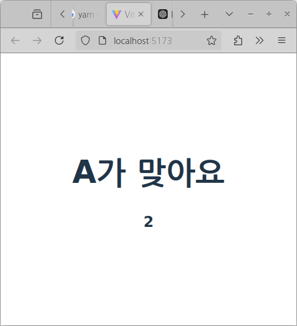
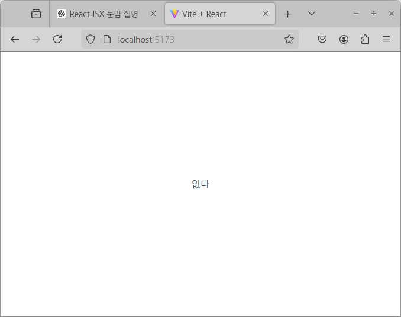
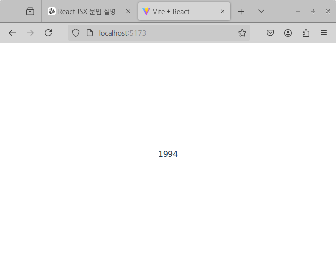
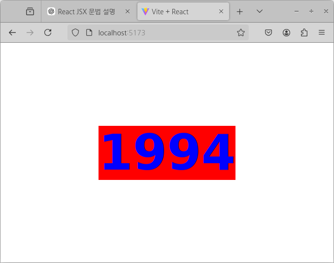
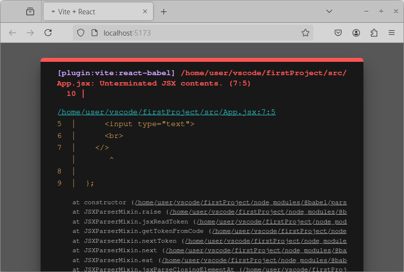
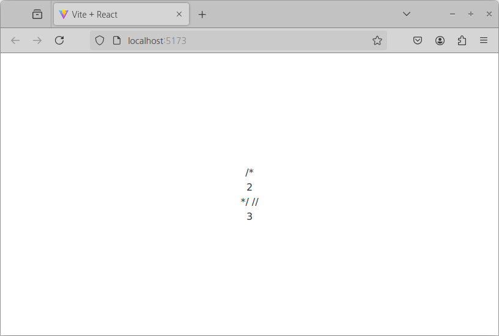

# JSX란 
처음 React 접하면 착각할수 있는것이 있습니다. "JSX는 React에 사용되는 HTML이구나"는 틀렸습니다<br>

JSX는 JavaScript XML의 약자고, JavaScript에서 HTML과 유사한 구문을 사용할 수 있게 해주는 문법입니다.<br>

실제로 작성된 코드가 브라우저에서 보여지는 것은 JavaScript 코드입니다

jsx로 작성된 코드 
```jsx
const App = () => <h1>Hello, world!</h1>;
```
브라우저에서 보이는 코드
```JavaScript
const App = () => /* @__PURE__ */ jsxDEV("h1", { children: "Hello, world!" }, void 0, false, {
  fileName: "/home/user/vscode/firstProject/src/App.jsx",
  lineNumber: 3,
  columnNumber: 19
}, this);
_c = App;
export default App;
```


# JSX  문법
JSX를 사용하기 위해서는 룰이 존재합니다
## 1. 상위 요소는 오직한개
부모태그가 반드시 있어야합니다 
div, span 상관없이 한개의 요소가 있어야하며 그 이유는  
작성한 JSX를 스크립트 소스로 변환하는 과정에서 오류가 발생합니다
예외가 있다면 문자열일 경우 변환과정이 필요없어 랜더링이 됩니다 
예제를 보겠습니다
```jsx
export default App import './App.css'

function App() {

  return (
    <>
      <h1>1</h1> 
      <h2>2</h2> 
    </>
  )
}

export default App
```
해당 코드일때는 정상구동합니다 


<br>
부모 태그가 없다면 어떻게 되는지 확인해보겠습니다

```jsx
export default App import './App.css'

function App() {

  return (
      <h1>1</h1> 
      <h2>2</h2>
  )
}

export default App
```

해당에러 내용은 인접한 요소에 태그로 맵핑되어야 한다구 에러를 출력해줍니다


## 2.자바스크립트 표현

JSX 내부에 {}기호를 사용하여  자바스크립트 표현식을 노출 시킬 수 있습니다
```jsx
import './App.css'

function App() {
  let str = 'hello word';
  return (
    <>
      <h1>{str}</h1> 
      <h2>2</h2> 
      </>
  )
}

export default App

```

## IF문 대신 조건부 연선자
JSX에서는 자바스크립트 표현식에서 if이 없어서 사용하실 수 없습니다
하지만 '{}'기호를 사용하여 연산자를 활요하여 if문과 비슷한 효과를 낼 수 있습니다


```jsx
import './App.css'

function App() {
  let str = 'A';
  
  return (
    <span>
      {str === 'A' ? <h1>A가 맞아요</h1> :<h1>{str}</h1>}
      <h2>2</h2> 
    </span>
  )
}

export default App

```


참일때만 보여지고 싶다면 어떻게 코드를 작성할 수 있을까요 
그것은 바로 null로 반환해주는것입니다 

```jsx
import './App.css'

function App() {
  let str = 'C';
  
  return (
    <span>
      {str === 'A' ? <h1>A가 맞아요</h1> :null}
      <h2>2</h2> 
    </span>
  )
}

export default App
```



현재 코드에서 더 짧게 만들수 있습니다 

그것은 AND(&&) 연산자를 사용하는것입니다 


```jsx
import './App.css'

function App() {
  let str = 'A';
  
  return (
    <span>
      {str === 'A' && <h1>A가 맞아요</h1>}
      <h2>2</h2> 
    </span>
  )
}
```


## null,undefined일때 랜더링 처리

화면쪽 코드를 작상하다보면 null,undefined일때가 있습니다
JSX에서 랜더링를 하지 않는데요 개발을 하다가 보면 default로 무언가를 출력하고 싶을때 
어떻게 하면 좋을까요 물론 조건부 연산자로 처리를 할 수 있지만 더 간결한 방법이 있습니다
그것은 ||(OR)연산을 하는것입니다  

```jsx
import './App.css'

const App = () => {
  let str = undefined; // null ,undefined 동일한 효과를 볼 수 있습니다

  return (str || '없다')
   
};

export default App
```


```jsx
import './App.css'

const App = () => {
  let str = '1994'; 

  return str || '없다'
   
};

export default App
```



## 인라인 스타일링
리엑트에서 요소에 스타일을 적용할때는 문자열이 아니라 객체 형태로 넣어주어야하며 몇가지 규칙이 있습니다 
만약 background-color를 줄려구 한다면 '-' 없애고 카멜표기법으로 작성해야합니다
JSX표현식으로 작성해주기 때문에 별도에 변수에 먼저 선언하지 않고 바로 안에서 작성하셔두됩니다
```jsx
import './App.css'

const App = () => {
  const style = { backgroundColor: 'red', color: 'blue', fontSize: '100px' };  
  let str = '1994'; 
  return <h1 style={style}>{str || '없다'}</h1> 
   
};

export default App
```
```jsx

import './App.css'

const App = () => {
  let str = '1994'; 
  return <h1 style={{ backgroundColor: 'red', color: 'blue', fontSize: '100px' }}>{str || '없다'}</h1> 
   
};

export default App
```



## class 대신 ClassName

일반적인 HTML에서 CSS 클래스를 사용할 때는 요소에 class 속성에 정의한 css를 작성하였고
리엑트 포준인 ClassName으로 추가 할 수있습니다 만약 비표준인 class를 사용하여 속성값을 주었다면 적용이 안되나요 그렇지는 않습니다만 리액트 룰에 맞아 않아 경고를 아래와 같이 출하고 의도한 CSS적용 될지는 의문입니다 

Warning: Invalid DOM property `class`. Did you mean `className`?

나중에 다시 이야기 드리겠지만 컴포넌트는 독립적으로 적이기 때문에 
서로 다른 컴포넌트에서 같은 class명과 다른 속성값이 있다면 컴포넌트별로에서 정의한 속성값으로 랜더링 됩니다

리엑트 표준 className를 사용 하는것을 권장드립니다

```css
.title {
  background-color: blue;
  color: red;
  font-size: 100px;
  font-weight: 100  ;
}
```
```jsx
import './App.css'

const App = () => {
  let str = '1994'; 
  return <h1 className="title">{str || '없다'}</h1> 
   
};

export default App

```

## JSX에서 HTML 태그 닫겨 있어야한다  
HTML에서는 스스로 닫히는 태그들이 존재합니다
대표적으로 태그 몇개를 이야기 하자면 br, input 있죠 이런 테그들을 self-closing tags이라구합니다
리엑트에서는 무조건 self-closing tags이라구 할지더라도 항상 닫아줘야합니다 
닫지 않는다면 오류가 발생합니다 

```jsx
import './App.css'

const App = () => {
  return <>
    <input type="text">
    <br>  
  </>
   
};

export default App
```


오류내용은 "JSX 콘텐츠가 닫히지 않았다"고 합니다 


## 주석 
JSX에서 주석은 표현식에서 블록단위 주석으로만 주석처리가 가능합니다 
이외의것은 모두 출력됩니다 
단 HTML주석은 <!-- --->은 에러를 발생시킵니다


```jsx
import './App.css'

const App = () => {
  return <>
  {/*
  <div>1</div>
  */}
  /*<div>2</div>*/
  //<div>3</div>
  </>
   
};

export default App
import './App.css'

const App = () => {
  return <>
  {/*
  <div>1</div>
  */}
  /*<div>2</div>*/
  //<div>3</div>
  </>
   
};

export default App
```


